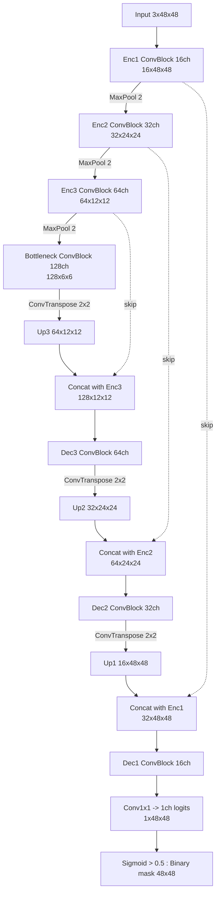

# Custom Lane U-Net Architecture

Input 48x48x3 RGB, output 48x48x1 binary mask. ~0.48 M parameters, trained from scratch.
`ConvBlock` = (Conv3x3 -> GroupNorm -> ReLU) x 2

```mermaid
graph TD
    IN["Input 3x48x48"] --> E1["Enc1 ConvBlock 16ch<br/>16x48x48"]
    E1 -->|MaxPool 2| E2["Enc2 ConvBlock 32ch<br/>32x24x24"]
    E2 -->|MaxPool 2| E3["Enc3 ConvBlock 64ch<br/>64x12x12"]
    E3 -->|MaxPool 2| B["Bottleneck ConvBlock 128ch<br/>128x6x6"]
    B -->|ConvTranspose 2x2| U3["Up3 64x12x12"]
    U3 --> C3["Concat with Enc3<br/>128x12x12"]
    E3 -. skip .-> C3
    C3 --> D3["Dec3 ConvBlock 64ch"]
    D3 -->|ConvTranspose 2x2| U2["Up2 32x24x24"]
    U2 --> C2["Concat with Enc2<br/>64x24x24"]
    E2 -. skip .-> C2
    C2 --> D2["Dec2 ConvBlock 32ch"]
    D2 -->|ConvTranspose 2x2| U1["Up1 16x48x48"]
    U1 --> C1["Concat with Enc1<br/>32x48x48"]
    E1 -. skip .-> C1
    C1 --> D1["Dec1 ConvBlock 16ch"]
    D1 --> H["Conv1x1 -> 1ch logits<br/>1x48x48"]
    H --> OUT["Sigmoid > 0.5 : Binary mask 48x48"]
```
